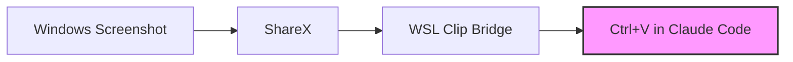

# 🌉 WSL Clip Bridge

<div align="center">

[](https://github.com/camjac251/wsl-clip-bridge/actions/workflows/ci.yml)
[](LICENSE)
[](https://www.rust-lang.org)
[](https://docs.microsoft.com/en-us/windows/wsl/)
[](https://claude.ai/code)

**Seamless clipboard sharing between Windows and WSL without X11**

Built specifically for **[Claude Code](https://claude.ai/code)** screenshot pasting in WSL

[Features](#features) • [Quick Start](#-quick-start) • [Usage](#usage) • [Configuration](#configuration)

</div>

## Why?

Ever wanted to paste a Windows screenshot directly into [**Claude Code**](https://claude.ai/code) running in WSL? Other solutions use background monitors, Windows tray apps, MCP servers, or require manual file management. WSL Clip Bridge is a simple drop-in xclip replacement—no daemons, no extra apps, just works.

Perfect for:
- 🤖 **[Claude Code](https://claude.ai/code)** → Paste screenshots directly in terminal
- 📸 **ShareX** → WSL clipboard workflows
- 🖼️ Any Windows → Linux clipboard needs

## Features

<table>
<tr>
<td>

**🔒 Secure**
- Home directory jail
- Size limits
- TTL auto-cleanup

</td>
<td>

**⚡ Fast**
- No X11/Wayland needed
- File-based emulation
- Native binaries

</td>
<td>

**🎯 Compatible**
- Drop-in xclip replacement
- Same CLI arguments
- Multi-arch (x64/ARM64)

</td>
</tr>
</table>

## 🚀 Quick Start

```powershell
# One-line install (Windows PowerShell)
iwr -useb https://raw.githubusercontent.com/camjac251/wsl-clip-bridge/main/scripts/setup.ps1 | iex
```

> [!TIP]
> The installer auto-detects your WSL distro, architecture, and sets up ShareX integration.

<details>
<summary><b>Manual Installation Options</b></summary>

### Download Pre-built Binary (WSL)
```bash
ARCH=$(uname -m | sed 's/x86_64/amd64/;s/aarch64/arm64/')
wget https://github.com/camjac251/wsl-clip-bridge/releases/latest/download/xclip-${ARCH}
chmod +x xclip-${ARCH}
sudo mv xclip-${ARCH} /usr/local/bin/xclip
```

### Build from Source (WSL)
```bash
git clone https://github.com/camjac251/wsl-clip-bridge
cd wsl-clip-bridge
cargo build --release --locked
sudo install -m 755 target/release/xclip /usr/local/bin/
```

</details>

## Usage

### Claude Code Workflow

1. **Take screenshot** with ShareX
2. **In Claude Code terminal**: Press `Ctrl+V` to paste directly

That's it! No commands needed for the primary use case.

> [!IMPORTANT]
> **Terminal Configuration Required**: Your terminal must forward `Ctrl+V` to the application, not intercept it for paste.
>
> - **Windows Terminal**: Settings → Actions → Remove/unbind `Ctrl+V` shortcut
> - **Warp**: Settings → Keyboard Shortcuts → Set "Paste" to `Ctrl+Shift+V`, Clear "Alternate Terminal Paste" (`Ctrl+V`)
> - **Other terminals**: Look for paste shortcuts and ensure `Ctrl+V` is not bound
>
> Without this, `Ctrl+V` won't reach Claude Code and pasting won't work.

### Manual Commands

| Action | Command |
|--------|---------|
| **Copy text** | `echo "Hello" \| xclip -i` |
| **Paste text** | `xclip -o` |
| **Copy image** | `xclip -t image/png -i screenshot.png` |
| **Check formats** | `xclip -t TARGETS -o` |

### ShareX Integration

> [!NOTE]
> The installer configures this automatically. Manual setup instructions below if needed.

<details>
<summary><b>Manual ShareX Setup</b></summary>

#### Step 1: Create the Batch File

Create `%USERPROFILE%\Documents\ShareX\Tools\copy-to-wsl-clipboard.bat`:

```batch
@echo off
rem WSL Clip Bridge - ShareX Integration
rem Replace "Ubuntu" with your WSL distro name (run 'wsl -l' to see available distros)

if "%~1"=="" (
    echo Error: No file path provided
    exit /b 1
)

rem Convert Windows path to WSL path and copy to clipboard
for /f "usebackq tokens=*" %%i in (`wsl -d Ubuntu wslpath -u "%~1"`) do set WSLPATH=%%i
wsl -d Ubuntu bash -lc "xclip -selection clipboard -t image/png -i '%WSLPATH%'"

if %ERRORLEVEL% NEQ 0 (
    echo Error: Failed to copy image to WSL clipboard
    exit /b %ERRORLEVEL%
)
```

**Important**: Replace `Ubuntu` with your WSL distribution name. Check with: `wsl -l`

#### Step 2: Configure ShareX

1. **ShareX** → **Task Settings** → **Actions** → **Add**:
   - Name: `Copy to WSL Clipboard`
   - File path: `%USERPROFILE%\Documents\ShareX\Tools\copy-to-wsl-clipboard.bat`
   - Arguments: `%input`
   - Hidden window: ✅ (recommended)

2. **After capture tasks** → **Add**:
   - ✅ Save image to file
   - ✅ Perform actions → Select "Copy to WSL Clipboard"

3. **Hotkey settings** (optional):
   - Set up `Ctrl+Shift+S` or your preferred shortcut
   - Action: Capture region

#### Step 3: Test It

1. Take a screenshot with ShareX
2. Open WSL terminal
3. Run: `xclip -t TARGETS -o` (should show `image/png`)
4. In Claude Code: Press `Ctrl+V` to paste

</details>

### Workflow Example



## Configuration

> [!IMPORTANT]
> Config auto-creates at `~/.config/wsl-clip-bridge/config.toml` on first run.

```toml
ttl_secs = 300                  # Clipboard expiry (5 min default)
max_image_dimension = 1568      # Auto-downscale for APIs
max_file_size_mb = 100         # Prevent memory bombs
restrict_to_home = true        # Security jail
```

<details>
<summary><b>Advanced Options</b></summary>

### Environment Variables
- `WSL_CLIP_BRIDGE_TTL_SECS` - Override TTL
- `WSL_CLIP_BRIDGE_CONFIG` - Custom config path

### Directory Whitelisting
```toml
allowed_directories = [
  "/mnt/c/Users/YOU/Pictures/ShareX",
  "/tmp"
]
```

### Image Optimization
- Auto-downscales to `max_image_dimension`
- Preserves aspect ratio
- Uses Lanczos3 (best for screenshots with text)

</details>

## Troubleshooting

<details>
<summary><b>Common Issues</b></summary>

### `xclip: command not found`
```bash
which xclip  # Should show /usr/local/bin/xclip
echo $PATH   # Ensure includes install directory
```

### Permission Denied
- Files must be within `$HOME` (unless whitelisted)
- Check: `ls -la ~/.cache/wsl-clip-bridge/`

### Ctrl+V Not Working in Claude Code
1. **Terminal is intercepting Ctrl+V**: Your terminal must forward the key to the app
   - Windows Terminal: Settings → Actions → Remove `Ctrl+V` binding
   - Warp: Settings → Keyboard Shortcuts → Set "Paste" to `Ctrl+Shift+V`, Clear "Alternate Terminal Paste"
2. Test with: `xclip -t TARGETS -o` (should show `image/png` after taking screenshot)

### Images Not Pasting
1. Verify format: `xclip -t TARGETS -o` should show `image/png`
2. Check size: Must be under `max_file_size_mb`
3. Supported: PNG, JPEG, GIF, WebP

</details>

## Architecture

<details>
<summary><b>How It Works</b></summary>

1. **No X11 Required**: Uses file-based clipboard emulation
2. **Secure**: Rust with `#![forbid(unsafe_code)]`
3. **Efficient**: TTL-based cleanup, automatic downscaling
4. **Compatible**: Full xclip CLI compatibility

```
~/.cache/wsl-clip-bridge/
├── text.txt        # Text clipboard
├── image.bin       # Image data
└── image.format    # MIME type
```

</details>

## Development

<details>
<summary><b>Building & Contributing</b></summary>

```bash
# Dev build
cargo build

# Run tests
cargo test

# Format & lint
cargo fmt
cargo clippy --all-targets --all-features -- -D warnings
```

**Tech Stack:**
- Rust 1.89+ (Edition 2024)
- No unsafe code
- GitHub Actions CI/CD
- Multi-arch releases (x64/ARM64)

</details>

---

<div align="center">

**Built with 🦀 Rust** • **Made for [Claude Code](https://claude.ai/code)** • **[Report Issues](https://github.com/camjac251/wsl-clip-bridge/issues)**

</div>